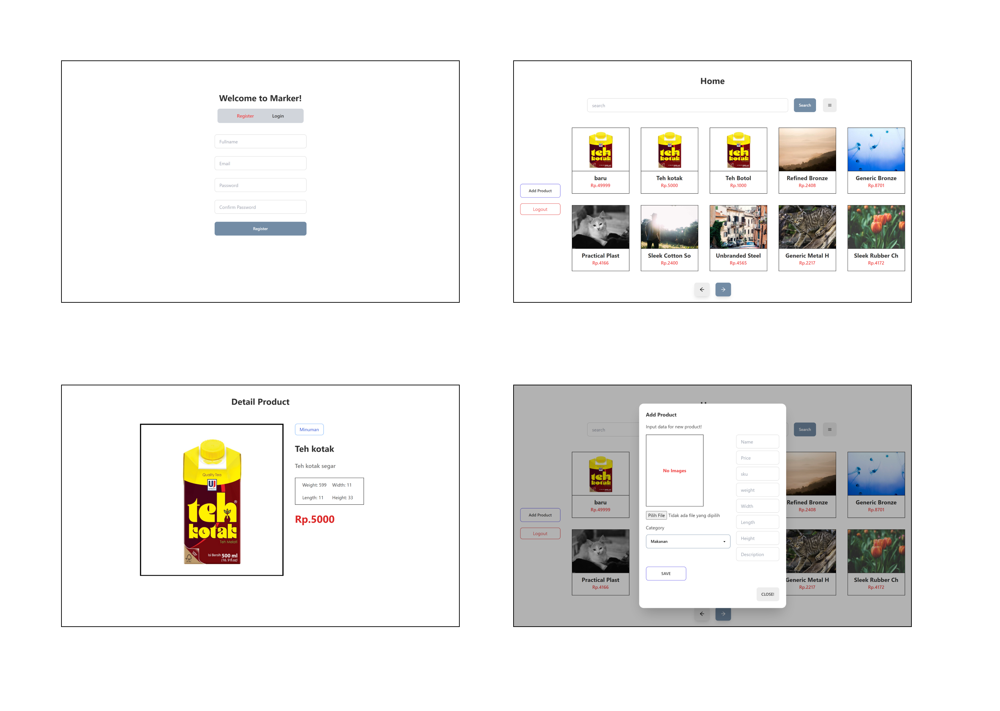
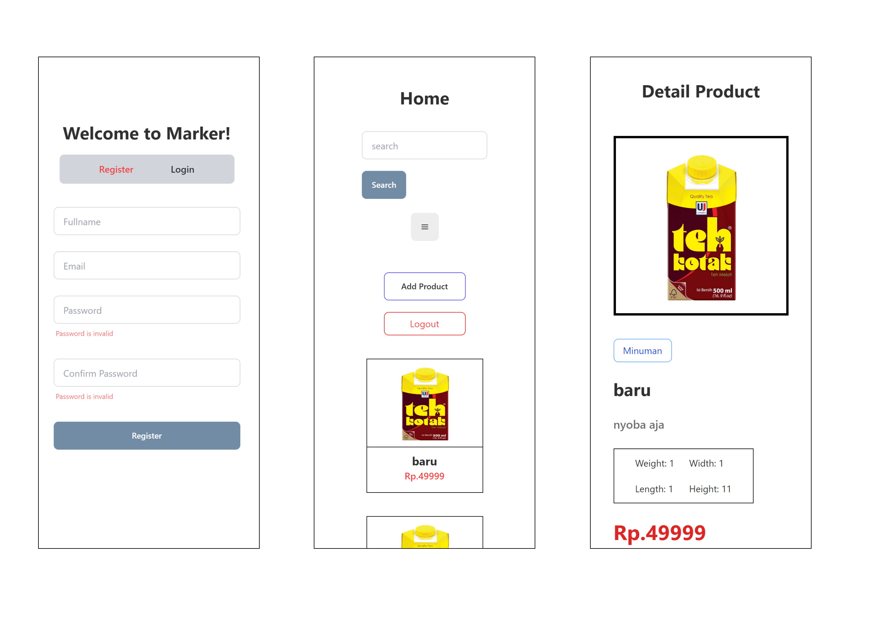

# Marker

#About The Project

Web application For A web application for listing products and creating new products

# Feature

- Up-to-date and reliable New Product
- And more

# View Page
##Dekstop Page

##Mobile Page

# Built with

<!-- - [fontend]() -->
1. [React js ](https://reactjs.org/)
2. [Tailwind](https://tailwindcss.com/)
3. [DaisyUi](https://daisyui.com/)

- [Backend](http://localhost:8800)
1. [Node js](https://nodejs.org/en/)
2. [Express js](https://expressjs.com/en/starter/installing.html)

# Tekno
- [Redux](https://redux.js.org/)
- [Axios](https://axios-http.com/docs/intro)
- [Argon](https://www.npmjs.com/package/argon2)
- [jwt token](https://www.npmjs.com/package/jsonwebtoken)
- [Multer](https://www.npmjs.com/package/multer)
- [Formik](https://formik.org/)

# How to use
1. Download file to Zip
2. Run with Vs code, npm i to install all package
3. use env: http://localhost:8800
4. Don't forget download Backend App to use Frontend App

